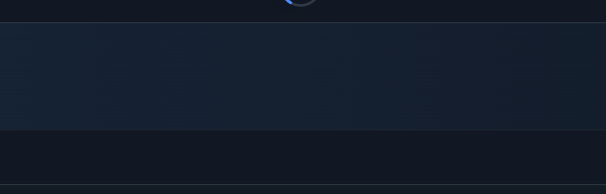

# Status Bar Guard

A **KernelSU module with a WebUI** that suppresses the Android status bar and notification shade **per app** — built to make full-screen Linux desktop sessions usable on a tablet.

```
Android status bar + notification shade
        ├── blocked / blanked while your chosen apps are in the foreground
        └── fully restored everywhere else
```

<p align="center">
  
</p>

---

## The problem this solves

Running a Linux desktop on a tablet (via [Termux:X11](https://github.com/termux/termux-x11) + an LXC container such as Droidspaces) has one very annoying failure mode: **push the mouse pointer to the top edge of the screen and the notification shade drops down**, stealing focus and breaking immersion.

Every "obvious" fix fails, and the reasons are interesting:

| Attempt | Why it fails |
|---|---|
| `policy_control immersive.full=*` | Only toggles *visual* UI flags; does not unhook the shade's gesture listener. On OxygenOS 16 the parser is gone entirely — **silently ignored**. |
| `cmd statusbar send-disable-flag expansion …` | The token `expansion` **does not exist**. The command fails silently, so it looks like a vendor override. The correct token is `statusbar-expansion`. |
| `appops set … MOUSE_POINTER_CAPTURE allow` | No such AppOps gate; pointer capture needs no permission. |
| Shrinking the X11 canvas (e.g. `3392x2380`) | The Android hardware cursor is not bounded by an app's canvas — it still reaches physical `y=0`. |
| Game Assistant / Game Space | Modern builds removed "add non-game apps"; `pm set-app-category` doesn't exist in AOSP. |

The actual fix is the correct AOSP flag plus a daemon that applies it contextually.

---

## How it works

### 1. The status bar and the shade are two different things

| Goal | Mechanism |
|---|---|
| **Block the shade** from dropping (mouse *or* finger) | `cmd statusbar send-disable-flag statusbar-expansion` → AOSP `DISABLE_EXPAND`, "disable expanding the notification panel by any means" |
| **Blank the bar contents** (clock, icons, battery) | `cmd statusbar send-disable-flag system-icons clock notification-icons` |

### 2. A daemon makes it per-app

`send-disable-flag` is global and **transient** (it is cleared whenever SystemUI restarts). The daemon polls the foreground app every 2 seconds and re-asserts the correct state:

```
        ┌─────────────────────────────┐
        │  daemon.sh  (every 2s)      │
        └──────────────┬──────────────┘
                       │
        foreground app ∈ apps.conf ?
             │                    │
            yes                   no
             │                    │
   statusbar-expansion      send-disable-flag none
   + system-icons clock     (everything restored)
   + notification-icons
```

This is what makes it *effectively* per-app even though the underlying flags are global.

### 3. Modes

| Mode | Behaviour |
|---|---|
| `auto` *(default)* | Only while an app in `apps.conf` is foreground |
| `global` | Shade blocked everywhere |
| `off` | Everything restored |

---

## Features

- **Per-app control** — pick any installed app; the bar and shade vanish only there
- **KernelSU WebUI** — no extra app to install; the module ships its own UI
- **Real app names and icons** — labels read from each APK's manifest, icons resolved from the launcher's own resource table
- **Search** across app name *and* package name
- **System-app toggle** — user apps by default, system apps behind a switch
- **Pull-to-refresh** — re-scan installed apps with a Material-style swipe gesture
- **Survives SystemUI restarts** — the daemon re-asserts state
- **Survives reboot** — installed as a KernelSU module with a boot service
- **Clean uninstall** — `uninstall.sh` restores the shade and removes config

---

## Requirements

| Requirement | Notes |
|---|---|
| Root | KernelSU, KernelSU Next, or Magisk |
| Android | 13+ (developed and verified on OxygenOS 16 / Android 15) |
| WebUI host | [KsuWebUI](https://github.com/a13e300/KsuWebUI) or the KernelSU manager's built-in WebView |
| *For icon generation only* | Python 3, `Pillow`, `androguard` |

---

## Install

1. **Copy the module** to your device:
   ```sh
   su -c "mkdir -p /data/adb/modules/statusbarguard"
   su -c "cp module/module.prop module/service.sh module/uninstall.sh /data/adb/modules/statusbarguard/"
   su -c "mkdir -p /data/adb/statusbarguard"
   su -c "cp module/daemon.sh module/refresh-dump.sh /data/adb/statusbarguard/"
   su -c "cp module/config.example /data/adb/statusbarguard/config"
   su -c "cp module/apps.conf.example /data/adb/statusbarguard/apps.conf"
   su -c "chmod 755 /data/adb/statusbarguard/*.sh"
   ```

2. **Deploy the WebUI** (build it first — see [Building the WebUI](#building-the-webui)):
   ```sh
   su -c "mkdir -p /data/adb/modules/statusbarguard/webroot"
   su -c "cp dist/index.html /data/adb/modules/statusbarguard/webroot/index.html"
   ```

3. **Start the daemon** (or reboot — `service.sh` starts it automatically):
   ```sh
   su -c "nohup sh /data/adb/statusbarguard/daemon.sh >/dev/null 2>&1 &"
   ```

4. **Open the WebUI**: KernelSU Manager → Modules → *Status Bar Guard* → WebUI.

---

## Usage

### WebUI

| Control | Purpose |
|---|---|
| **Mode** | `auto` / `global` / `off` |
| **Apps list** | Tick an app to protect it. Search by name or package. |
| **Show system apps** | Reveals system packages (hidden by default) |
| **⟳ / pull down** | Re-scan installed apps (picks up new installs/uninstalls) |
| **Clear all** | Deselect everything |
| **Save & apply** | Writes `apps.conf`; the daemon picks it up within ~2 s |

### Command line

```sh
# Check daemon status
su -c "ps -A -o args | grep statusbarguard/daemon.sh"

# Tail the activity log
su -c "tail -f /data/adb/statusbarguard/statusbarguard.log"

# Add an app manually
su -c "echo com.example.app >> /data/adb/statusbarguard/apps.conf"

# Restore the status bar right now
su -c "cmd statusbar send-disable-flag none"

# Switch mode
su -c "sed -i 's/^MODE=.*/MODE=global/' /data/adb/statusbarguard/config"
```

---

## Repository layout

```
status-bar-guard/
├── module/                     # KernelSU module payload (deployed to /data/adb)
│   ├── module.prop             # module metadata
│   ├── service.sh              # boot hook — starts the daemon
│   ├── uninstall.sh            # restores the shade, removes config
│   ├── daemon.sh               # the foreground-watching loop
│   ├── refresh-dump.sh         # dumps installed packages for icon generation
│   ├── config.example          # MODE=auto|global|off
│   └── apps.conf.example       # one package name per line
├── webui/                      # WebUI sources
│   ├── index.html              # markup (assets are inlined at build time)
│   ├── app.css                 # styles
│   ├── app.js                  # logic: bridge, app list, pull-to-refresh
│   └── build.py                # inlines CSS/JS/meta → dist/index.html
├── tools/
│   └── gen_meta.py             # generates appmeta.js (labels + icons) from APKs
├── docs/                       # screenshots
├── README.md
├── LICENSE
└── .gitignore
```

---

## Building the WebUI

The KernelSU WebView **does not load external files from the module's `webroot`**, so CSS and JS must be inlined into a single HTML file.

```sh
cd webui

# 1. Generate app metadata (labels + icons) from the installed APKs
python3 ../tools/gen_meta.py

# 2. Inline everything into one self-contained file
python3 build.py
# → dist/index.html

# 3. Deploy
su -c "cp dist/index.html /data/adb/modules/statusbarguard/webroot/index.html"
```

### About `gen_meta.py`

`appmeta.js` is **generated, never committed** — it contains *your* installed app list and icons, which is device-private data.

Icon resolution order (most accurate first):

1. **ARSC resolution** — read `android:icon` from the manifest, resolve it through the resource table. This yields the *same file the launcher renders*.
2. **Adaptive icons** — for `mipmap-anydpi-v26` XML icons, resolve the background (colour or raster) and foreground layers, composite them on a 108 dp canvas, then crop to the visible 72/108 dp area exactly as the launcher does.
3. **`androguard`'s resolver**
4. **Zip scan** of `res/mipmap*` / `res/drawable*`
5. **Letter avatar** — deterministic HSL colour, for apps whose icons are vector-only

> **Note:** labels come from `androguard`'s `get_app_name()`. A common pitfall is using `pyaxmlparser`, which resolves resource-based labels incorrectly (e.g. returning *"Android Music"* for Apple Music).

---

## Implementation notes

Hard-won details, in case you are building something similar.

### KernelSU WebUI bridge

The bridge differs between hosts, so `app.js` auto-detects:

| Host | API shape |
|---|---|
| **KsuWebUI** | `ksu.exec(cmd)` returns **stdout synchronously as a string**. Passing a callback **throws a Java exception**. |
| **KernelSU manager** | `ksu.exec(cmd, {}, callback(errno, stdout, stderr))` |

Two further quirks:

- **Multi-line output is unreliable** through the bridge (only the last line survived). Shell commands therefore end with `tr "\n" "\001"` and JavaScript splits on `\u0001`.
- **`ksu.moduleInfo()` returns the *module* directory** (`/data/adb/modules/<id>`), not the data directory. The UI probes for `daemon.sh` and switches to `/data/adb/<id>` when needed.

### Pull-to-refresh

<p align="center">
  
</p>

Implemented to match Material's *swipe to refresh*:

- A faint **track circle** with a coloured **arc** on top (`stroke-dasharray` / `stroke-dashoffset`)
- The arc **grows** with pull distance and **creeps** around the track
- The indicator **descends and scales** with the pull (Material geometry)
- Past a threshold it turns **green** (armed); releasing triggers the refresh
- While refreshing, the arc animates its dash *and* the ring rotates — the classic indeterminate sweep
- Motion is **smoothed with `requestAnimationFrame`** exponential interpolation, so it feels weighted rather than snapping to the finger
- The gesture is claimed with a **non-passive `touchmove` + `preventDefault()`** once a genuine pull is detected at `scrollTop <= 0`; normal scrolling is untouched

**Gotcha:** a CSS animation replaces the entire `transform` property. Positioning the spinner and animating its rotation on the *same element* cancels one of them out. The fix is two layers — an outer element that JS positions, and an inner element that CSS animates.

---

## Troubleshooting

| Symptom | Cause / fix |
|---|---|
| WebUI shows "daemon stopped" | Daemon not running: `su -c "nohup sh /data/adb/statusbarguard/daemon.sh >/dev/null 2>&1 &"` |
| App list is empty | WebView bridge unavailable — open the page inside KsuWebUI or the KernelSU manager, not an external browser |
| Icons missing for some apps | Expected — vector-only icons fall back to letter avatars. Re-run `gen_meta.py`. |
| Shade comes back after a while | SystemUI restarted and the daemon isn't running. Check the log. |
| Changes don't apply | Verify `apps.conf` has real newlines (not literal `\n`) and that `MODE=auto` |
| Bar contents still visible | Add `system-icons clock notification-icons` to the flag list in `daemon.sh` |

---

## Known limitations

- **The bar's space may still be reserved** as an empty strip in some apps; apps that draw edge-to-edge look fully immersive.
- **~2 second latency** when switching apps (the daemon's poll interval).
- **Icons are not themed.** They are rendered the way the launcher renders its *default* icon set; launcher-side icon theming (themed/monochrome icons) is internal to the launcher and would require hooking it.
- **Per-app immersive mode is impossible on modern Android** — `policy_control` is ignored, which is precisely why this module exists.

---

## Verified on

| | |
|---|---|
| Device | OnePlus Pad 3 (OPD2415) |
| OS | OxygenOS 16.0.1.302 (Android 15 base) |
| Root | KernelSU (SUSFS) |
| Desktop | XFCE via Termux:X11 + Droidspaces |

---

## License

[MIT](LICENSE)
