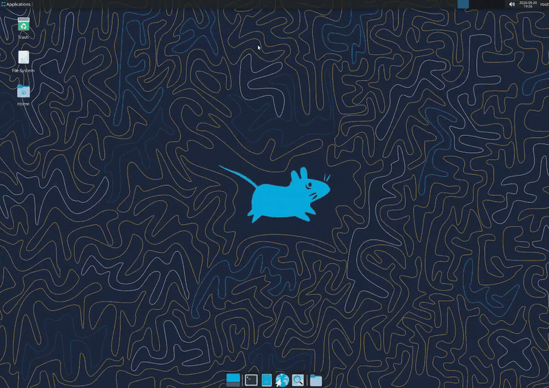
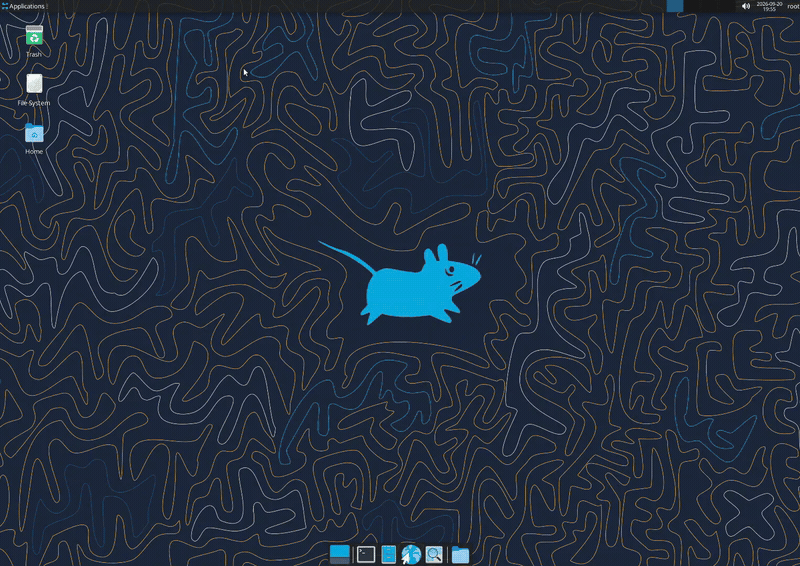
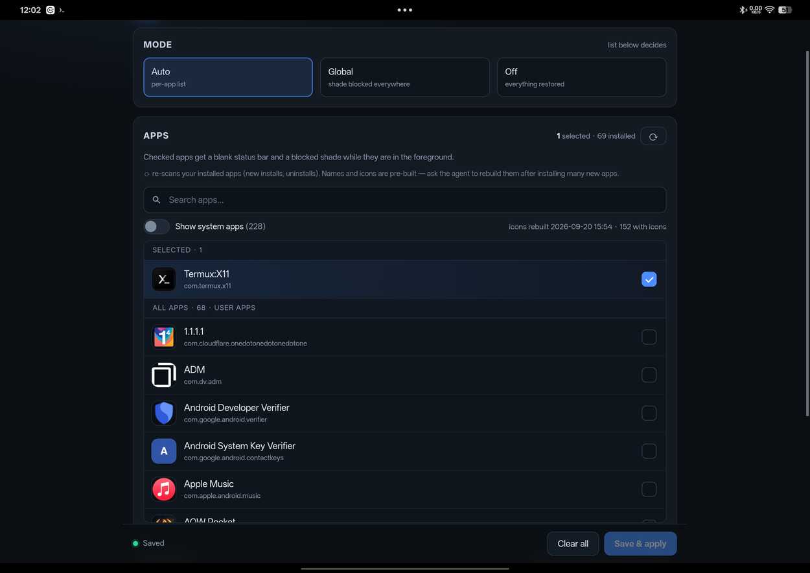
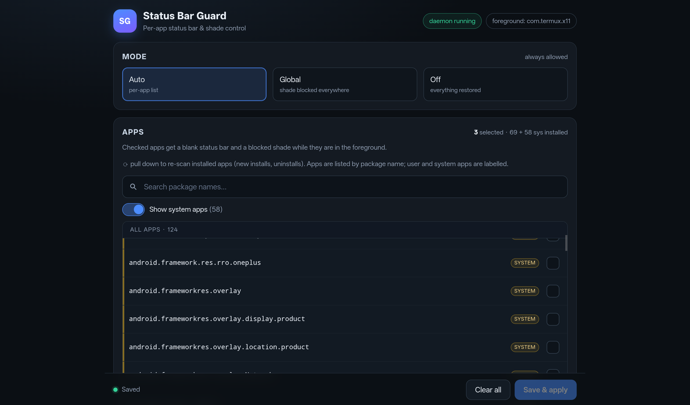

# Status Bar Guard

A **KernelSU module with a WebUI** that suppresses the Android status bar and notification shade **per app** — built so full-screen Linux desktop sessions (Termux:X11 + an LXC container) stay usable on a tablet.

Push the mouse to the top edge and the notification shade drops down, stealing focus. Every "obvious" fix fails — `policy_control` is ignored on modern OxygenOS, and `send-disable-flag expansion` uses a token that doesn't exist. This module uses the correct AOSP flag and applies it contextually.

<p align="center">
  <b>Without Guard (Before)</b><br>
  Pushing the mouse to the top edge pulls down the Android shade & status bar:<br>
  
</p>

<p align="center">
  <b>With Guard (After)</b><br>
  Cursor pushes flush against the top panel — status bar is suppressed and shade never drops:<br>
  
</p>

<p align="center">
  
  <br>
  
</p>

## What it does

| Goal | Mechanism |
|---|---|
| **Block the shade** (mouse *or* finger) | `cmd statusbar send-disable-flag statusbar-expansion` → AOSP `DISABLE_EXPAND` |
| **Blank the bar contents** (clock, icons, battery) | `cmd statusbar send-disable-flag system-icons clock notification-icons` |

Those flags are global and **transient** (SystemUI restarts clear them), so a small daemon watches the foreground app and re-asserts the right state. It reads the foreground package from Android's `input_focus` event log rather than polling `dumpsys`, so a cycle forks **no processes at all** (~0.7 % of one core at the default 0.5 s):

```
foreground app in apps.conf ?  ── yes ──> shade blocked + bar blanked
                               └─ no  ──> everything restored
```

This is what makes it *effectively* per-app even though the underlying flags are global.

| Mode | Behaviour |
|---|---|
| `auto` *(default)* | Only while an app in `apps.conf` is foreground |
| `global` | Shade blocked everywhere |
| `off` | Everything restored |

**The app list is deliberately plain:** one row per **package name**, no icons and no display names. Each row is labelled `user` or `system`, read live from `pm list packages -3` / `-s` on the device — so the UI needs no per-device metadata and looks identical on every install.

## Requirements

- Root: **KernelSU**, KernelSU Next, or Magisk
- Android 13+ (developed on OxygenOS 16 / Android 15)
- A WebUI host: [KsuWebUI](https://github.com/a13e300/KsuWebUI) or the KernelSU manager's built-in WebView

## Install

### Option A — flashable zip (recommended)

Download the latest `status-bar-guard-*.zip` from [Releases](../../releases) and flash it in your root manager (KernelSU Manager → Modules → *Install from storage*, or Magisk → Modules → *Install from storage*). Reboot.

Existing configuration is **preserved** on upgrade.

### Option B — manual

```sh
su -c "mkdir -p /data/adb/modules/statusbarguard /data/adb/statusbarguard"
su -c "cp module/* /data/adb/modules/statusbarguard/"
su -c "cp module/daemon.sh module/refresh-dump.sh /data/adb/statusbarguard/"
su -c "cp module/config.example /data/adb/statusbarguard/config"
su -c "cp module/apps.conf.example /data/adb/statusbarguard/apps.conf"
su -c "chmod 755 /data/adb/statusbarguard/*.sh"
su -c "mkdir -p /data/adb/modules/statusbarguard/webroot"
su -c "cp dist/index.html /data/adb/modules/statusbarguard/webroot/index.html"   # see Building below
su -c "nohup sh /data/adb/statusbarguard/daemon.sh >/dev/null 2>&1 &"
```

Then open the WebUI: **KernelSU Manager → Modules → Status Bar Guard → WebUI**.

## Usage

**WebUI** — tick the packages you want protected, then **Save & apply** (the daemon picks it up within ~2 s).

| Control | Purpose |
|---|---|
| Mode | `auto` / `global` / `off` |
| Apps list | One row per package name, labelled `user` / `system`; tick to protect |
| Search | Filters package names |
| Show system apps | Reveals system packages (hidden by default) |
| Pull down | Re-scan installed apps (new installs / uninstalls) |
| Save & apply | Writes `apps.conf`, then reads it back and shows what the daemon will actually see |

**Command line**

```sh
su -c "ps -A -o args | grep statusbarguard/daemon.sh"        # daemon running?
su -c "tail -f /data/adb/statusbarguard/statusbarguard.log"  # activity log
su -c "echo com.example.app >> /data/adb/statusbarguard/apps.conf"
su -c "cmd statusbar send-disable-flag none"                 # restore now
su -c "sed -i 's/^MODE=.*/MODE=global/' /data/adb/statusbarguard/config"
su -c "sed -i 's/^#*POLL=.*/POLL=0.25/' /data/adb/statusbarguard/config"   # faster reaction
```

## Building the WebUI

The WebView does not load sibling files from `webroot/`, so everything is inlined into one HTML file.

```sh
cd webui
python3 build.py               # → dist/index.html
```

No metadata step is needed: the UI reads the package list and the user/system split from `pm` at runtime.

To produce the flashable module zip:

```sh
./build_zip.sh     # → dist/status-bar-guard-<version>-<sha>.zip
```

It rebuilds `dist/index.html`, stages `module/` + `META-INF/` + `webroot/index.html`, and zips the result. The build is reproducible from the repo alone, on a clone or in CI.

## Troubleshooting

| Symptom | Fix |
|---|---|
| WebUI says "daemon stopped" | `su -c "nohup sh /data/adb/statusbarguard/daemon.sh >/dev/null 2>&1 &"` |
| App list is empty | Open the page inside KsuWebUI / the KernelSU manager — not an external browser |
| Some packages missing | Pull down to re-scan; system packages need **Show system apps** |
| Shade returns after a while | v2.4+ repairs this within ~30 s (SystemUI watchdog + heartbeat). On older builds the daemon kept a stale state cache and never re-asserted — restart it, or upgrade |
| Changes don't apply | Confirm `apps.conf` has real newlines (not literal `\n`) and `MODE=auto` |
| Bar contents still visible | Add `system-icons clock notification-icons` to the flag list in `daemon.sh` |

## Known limitations

- The bar's **space may remain reserved** as an empty strip in some apps; apps that draw edge-to-edge look fully immersive.
- **Poll-interval latency** when switching apps: ≤0.5 s by default (`POLL` in the config; 2 s was the old default). Measured ≈0.5 s end-to-end on the Pad 3.
- **Cost:** ~0.7 % of one core (≈0.09 % of an 8-core SoC) at the default `POLL`. This is down from 13.5 % of one core in v2.5 — see `docs/IMPLEMENTATION.md`.
- **Rows show package names, not friendly app names** — deliberate: package names are unambiguous, sort predictably, and need no per-device metadata.
- **Per-app immersive mode is impossible on modern Android** (`policy_control` is ignored), which is why this module exists.

Verified on **OnePlus Pad 3 (OPD2415)**, OxygenOS 16.0.1.302, KernelSU — with XFCE via Termux:X11 + Droidspaces.

## More

Contributor deep-dives — the KernelSU WebUI bridge quirks, pull-to-refresh implementation, the retired icon/label pipeline, and why each failed approach fails — live in **[docs/IMPLEMENTATION.md](docs/IMPLEMENTATION.md)**.

## License

[MIT](LICENSE)
